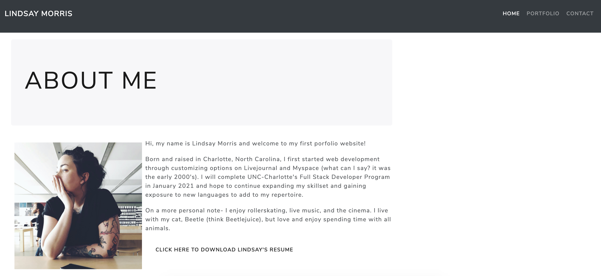
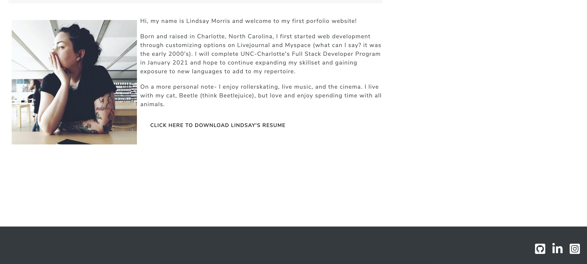
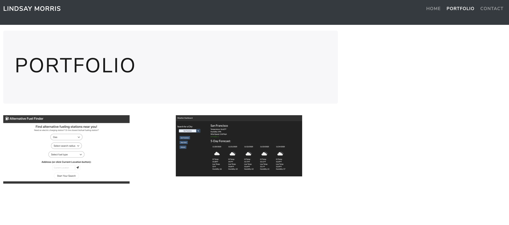
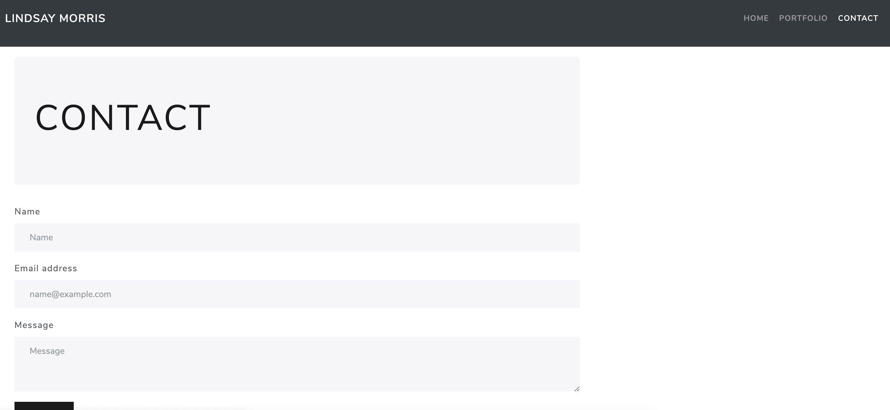

# portfolioUpdated

Updated portfolio1 homework with Project 1 and 2 other homework assignments and resume, etc...

[Deployed Page](https://lindsaymorris813.github.io/Portfolio3)

[Repository](https://github.com/lindsaymorris813/Portfolio3)

IMAGES:
  

# Unit 08 Project 1 Homework: Professional Materials

Now that you've built a full-stack web application and have another project to share, you'll be updating your portfolio page and other materials to build toward being employer-competitive.

If you are opting out of career services, this is *still a required assignment*. Part of being a web developer means being a part of a community. Having a place to share your projects is *necessary* if you're applying for jobs, but it's also *critical* on your journey as a developer.

## Requirements

* Updated portfolio featuring at least 3 examples of student work from either deployed projects of homeworks

* Update GitHub profile with pinned repositories featuring at least 3 examples of student work from either deployed projects of homeworks

* Updated resume

* Updated LinkedIn profile

## Installation

N/A

## Usage

An updated portfolio for potential employers or teammates to view and get a better idea of my capabilities and proficiences as they grow.

## Contributing

Bootstrap CSS
JQuery

## License
N/A
